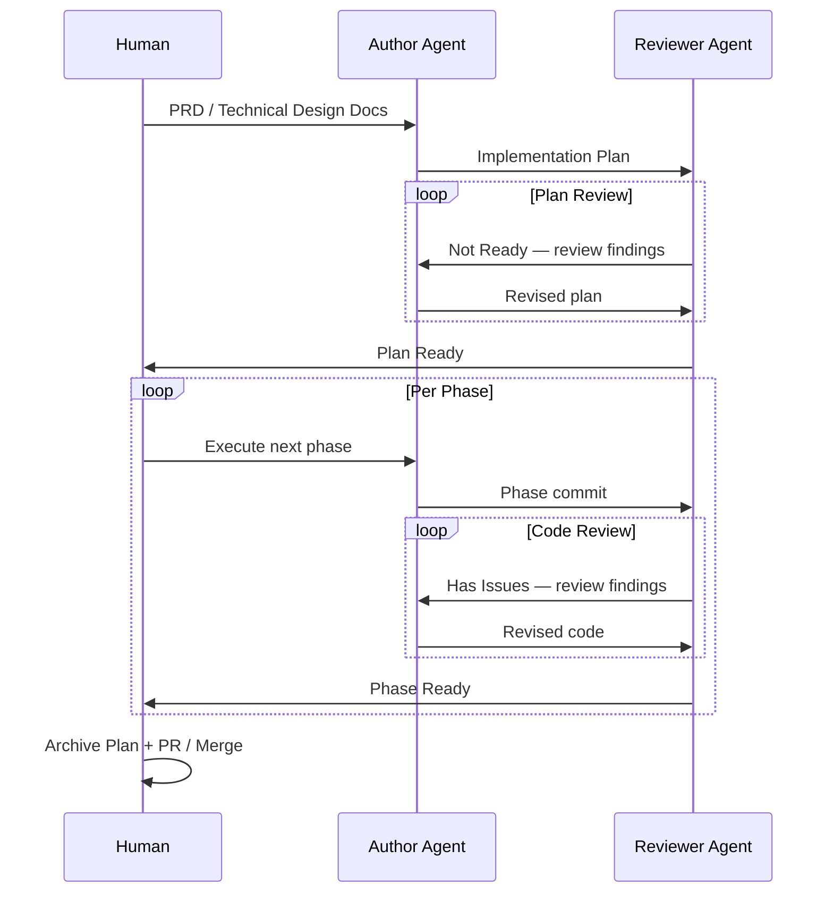

# The 5x Engineer
*Moving pretty fast without breaking things*

## Introduction

We should be skeptical of much of the agentic coding discourse, dominated by performative acts of massively parallelized code generation (and token spend). Yet the value is real and has quietly supercharged the capabilities of individual developers, especially those who are grounded in good fundamentals to begin with. The goal is high velocity without quality collapse as surface area and complexity scale. One week of traditional programming output per day of agentic programming is feasible, with quality engineering fundamentals and process rigor. Hence, the 5x Engineer, slow and steady but sure to finish and likely to win.

## Principles of the 5x Engineer

### You bring the taste

- Your primary concern is the user, and your unique value is *taste* and *empathy*
- Care about the code, but agents are faster and probably better than you at writing it
- Your primary role is product design, architecture, and quality control
- You work with two agents: an author (code, docs, and tools) and a reviewer

### Apply the fundamentals

Agents amplify your velocity but also your mistakes. These guardrails are not optional.

- Source control
- Automated deployment pipeline
- Containerized local deployments for testing
- Pre-commit/push hooks (lint/build/unit/component tests)
- Automated test coverage & fast test suite execution
- PR validation hooks for all unit and integration test suites

### Design before code

- Product Requirements and Technical Design documentation first
- Agents do the writing
- Decompose documentation to keep individual files smallish and crosslink to form a graph; facilitates efficient context window usage with progressive discovery for agents
- Correct drift between implementation and design docs during reviews

### Build from plan files

- Agent writes implementation plan from PRD/TDD for a body of work
- Phased plan with checklists
- 1 branch/PR per phase (smaller scope plans can be 1 commit per phase on one branch/PR)

### Size tasks to context window

- Clean context window every implementation phase
- Commit each phase
- Auto-compaction quality varies - when in doubt, write a file to resume

### Author and review with different models

- Smartest model is the reviewer (e.g. GPT 5.2)
- Faster model is the author (e.g. Opus 4.5)
- Create a review template with addendum format; save all reviews
- Invoke Staff Engineer for review ("review from the perspective of a Staff Engineer")
- Rework with author until all reviewer issues closed; addendums track progress

### Save all artifacts

- Archive completed plan files
- Save all review files; include date in filename for easy sequencing
- Productivity and process improvement insights can be data mined over time

### Curate local knowledge

- Create and maintain your `AGENTS.md` file
- Enumerate common mistake patterns to reduce rework
- Analyze artifact and repo history to identify patterns - agents will do this for you

### Refactor and attack technical debt consistently

- Plan mechanical refactors with authoring agent and write a detailed implementation plan
- Plan execution is fast and straightforward; could use cheaper/faster model (e.g. Grok Code Fast/Composer 1)

## Workflow

The core loop is a two-phase cycle with human-gated review checkpoints. The author agent writes; a separate, stronger reviewer agent critiques. The human decides when to proceed.

**Key points:**
- Author and reviewer are different models to prevent self-review bias
- Review findings are priority-tiered (P0 blocker / P1 high / P2 medium)
- Review documents accumulate addendums rather than being replaced, creating an audit trail
- Implementation plans are living documents; checklists are checked off and revision history appended as phases complete
- Clean the context window between phases; commit and start fresh

## Resources

### Commands

Workflow commands for the author and reviewer agents. Formatted for [OpenCode](https://github.com/opencode-ai/opencode); can also be placed in `.claude/commands/` for [Claude Code](https://docs.anthropic.com/en/docs/claude-code/overview).

| Command | Purpose |
|---|---|
| [workflow-author-next-phase.md](commands/workflow-author-next-phase.md) | Execute the next phase of an implementation plan (Author Agent) |
| [workflow-author-process-review.md](commands/workflow-author-process-review.md) | Address review feedback and revise code or plan docs (Author Agent) |
| [workflow-reviewer-review-commit.md](commands/workflow-reviewer-review-commit.md) | Staff Engineer review of a commit or phase (Reviewer Agent) |
| [workflow-reviewer-review-implementation-plan.md](commands/workflow-reviewer-review-implementation-plan.md) | Staff Engineer review of an implementation plan (Reviewer Agent) |

### Templates

| Template | Purpose |
|---|---|
| [Implementation Plan](docs/_implementation_plan_template.md) | Phased implementation plan with scope scaling guidance, completion gates, and checklists |
| [Staff Review](docs/development/reviews/_review_template.md) | Priority-tiered review document with readiness verdict and addendum format |

### Sample Artifacts

Completed examples showing what the templates look like after going through the full lifecycle.

| Sample | What it demonstrates |
|---|---|
| [AGENTS.md](docs/_sample_agents.md) | A mature agent guidelines file with architecture rules, testing standards, and a done checklist |
| [Completed Implementation Plan](docs/000-impl-sample-inline-entity-links.md) | Full plan lifecycle: design decisions, phased checklists, and revision history tracking P0 resolutions from review |
| [Review with Addendums](docs/development/reviews/2026-01-24-sample-inline-entity-links-review.md) | The review loop for the same plan: initial "not ready" verdict through 4 addendums to "production ready" |

### Sample Reports

| Report | Purpose |
|---|---|
| [Engineering Velocity Report](docs/reports/2026-02-02-january-2026-engineering-velocity-report.md) | Monthly throughput measurement with repeatable git-based methodology and velocity multiplier estimate |
| [Implementation Feedback (Start/Stop/Continue)](docs/reports/2026-02-01-implementation-feedback-start-stop-continue.md) | 30-day qualitative review with actionable AGENTS.md rules and a done checklist |

## Further thoughts

- Teams can scale with this process but also individuals can go wide on compartmentalized plans; use git worktree for isolation. Personally, I don't feel super productive with constant context switching, so I tend to stick to a single stream.
- This process is model and harness agnostic. Don't get too comfortable as the landscape is constantly changing and shifting.
- This article will be obsolete within the year, a curious artifact of the agentic coding revolution.
